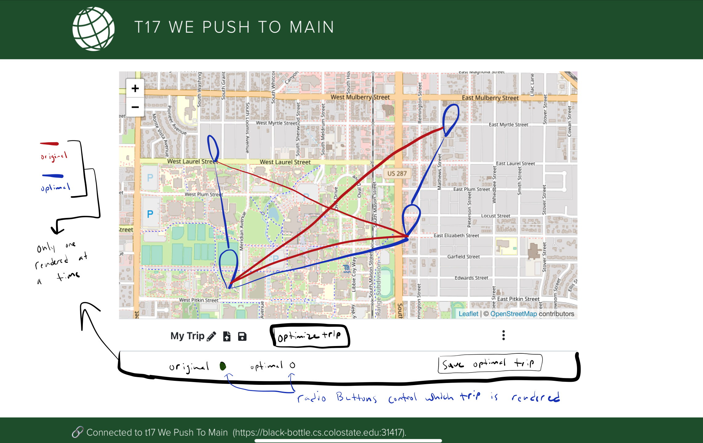
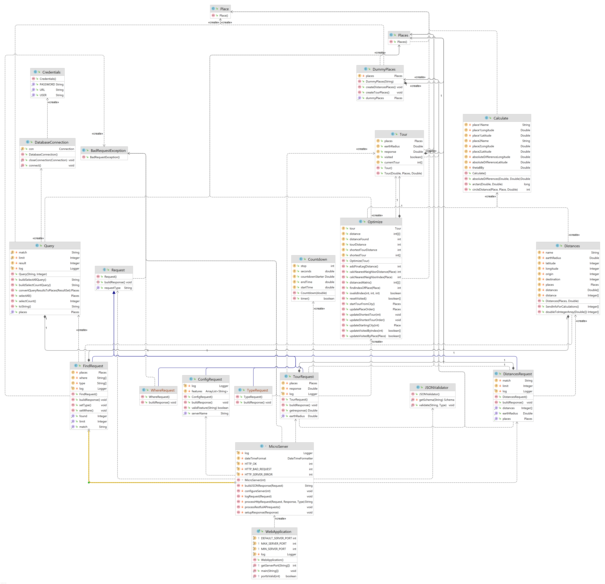

# Introduction

This document describes the architecture and design of a single page web application that interacts with microservices via RESTful APIs.
The key elements in this document include the architecture, user interface, client components, and server classes.

This is a living document that is updated as changes are made each sprint.
The initial document describes the Base code students are given as a starting point for the semester.
Students are expected to update this document as changes are made each sprint to reflect the evolution of their application and key decisions they make.
The Base section serves as an example.

# Base

The Base is a simple application to provide the architecture to the students at the beginning of the semester.
The JavaScript code will be useful examples for students to learn from and leverage in the code they write for sprint 1.
The progressive display of information using collapsible sections and popups will serve as examples of good user interface design.
The overall design is somewhat minimalist/simple for the intended mobile device audience.

### Architecture

The Base architecture is a JavaScript single page web application in an HTML5 browser that uses RESTful APIs to access Micro-services provided by a Java server running on Linux.
The client consists of a minimal index.html file that loads and executes the bundled JavaScript application.
The client and server files are bundled into a single JAR file for execution on the Linux server at a specified port.
The browser fetches the client files from the server on the specified port.

The browser loads the index.html file (by default) which in turn loads the bundled JavaScript single page application bundle.js.
* The single page application makes RESTful API requests to the server on the same port using  JavaScript's asynchronous fetch.  
* A protocol document describes the JSON format for the RESTful API requests and responses.
* JSON Schemas are used to verify requests on the server side and responses on the client side.
* On the client, ReactJS renders the application using ReactStrap, Leaflet, and application defined components.
* GSON is used on the server to convert JSON requests to Java objects and Java objects to JSON responses.
* The client (ulog) and server (SLF4J) logging mechanisms control debugging output during development and production - print statements and console logging should never be used. 

The following architecture elements are not included in the Base system.
They will be added later in the semester.
* Client filesystem.
* Server SQL.
* Server concurrency.

### User Interface

The basic screen in black shows the view on a mobile device, with a header, footer, and trip.
The header contains a earth logo and the team name obtained from the server when the client was loaded.
The footer contains a connection icon along with the current server name and server URL the client is connected to.
The trip shows a map and the current list of destinations.

Rather than buttons or icons to signify actions, we are associating actions with elements that are already on the screen to reduce the clutter.
We are using both popups and collapsible sections in this design rather than choosing to use one exclusively.
* Collapsible/Hidden sections are used for the map and about sections since they have a significant amount of content and we don't need to see them at the same time.
* A popup is used for the URL change since we want to control the interaction until the operation is completed. It seemed more natural than another collapsible section.

#### Clicking on the team name in the header displays an empty about screen.
Clicking again restores the trip screen.
We will fill this in later.

#### Clicking on the map adds to the trip.
Whenever a user clicks on the map, the client should display a marker with latitude, longitude, and a description at that location.
The description is obtained from reverse geocoding.
The location information is also added to the trip list below the map.
We only maintain a single marker at this point displaying the most recently clicked location.

#### Clicking the hamburgers (&#8942;) displays a menu of options.
At the trip level you can add the home (CSU Oval) location or clear the list.
At the destination level you can remove that destination from the list.

#### Clicking on the URL in the footer should let me change the server.
Whenever a user clicks on the URL a popup should open showing the team name, the URL in an input text box, and a Cancel button.
When the user modifies the URL, the client will attempt to connect to the new server and update the configuration.
When the Test button is clicked, it will attempt to connect to the server.
If not successful, nothing changes and the user may continue to make URL changes or click the Cancel button to return to the original sever (it shouldn't change).
If successful, the new server name should appear and a Save button should replace the Test button.
When the user clicks the Save button, the server connection should change and the popup closes, revealing the new servername and URL in the footer.

### Component Hierarchy
The component hierarchy for the base application depicted below shows the our top level App component with four children components.
* App renders the major components on the screen.
* Header renders an icon and a team name in the top banner.
* Footer renders the current server connection in the bottom footer.
* Atlas renders a map.
* About renders information about the team.

We do not show the many ReactStrap components in this hierarchy, even though they will appear when you are debugging on the client.

### Class Diagram
The class diagram for the base application depicted below shows the basic structure of the web server application.

The classes in blue represent the classes specific to this application.  
* WebApplication processes command line parameters and creates MicroServer.
* MicroServer start a web server on the given port, configures the server for security, static files, and APIs for different types of requests, and processes the requests as they arrive.
* JSONValidator verifies a request is properly formatted before attempting to process it using JSON Schemas.
* ConfigRequest is a specific request that allows the server to respond with its configuration to allow interoperability between clients and servers. 
* Request defines the basic components of all requests.
* BadReqeustException allows us to distinguish bad requests from other types of exceptions that may occur.

These test classes provide automated tests for unit testing.
* TestWebApplication
* TestConfigRequest
* TestJSONValidator

# Sprint 1

### User Interface

In this sprint, we will focus on team information.
There are two primary parts:
* browser tab, header, and footer.
* about page which includes team and member information,

Whenever a user clicks the team name in the header, a collapsible section should appear under the header with information about the team.
The collapsible map should disappear so only the about or map are displayed.
A simple toggle in state should be able to control this rendering.
The about page should contain the team name as a heading. 

The team name in the browser tab, header and are simple changes to constants in the client and server.

### Client Components

We will add 3 new components to the base architecture on the client to support the about page.
* Team component will render the team information
* Person component will render the individual information for a team member
* AboutCard component will render the team/individual information in a consistent fashion.

The existing About component will be modified to control the layout of the Team and Person components on the page.

### Server Classes
There are no changes to the server class structure in this sprint.
Only minor changes to text constants are required.

# Sprint 2

### User Interface
- Find Location UI element

- Select Location UI element

The user interface will largely stay the same as it was after Sprint 1.  Small improvements will be made, such as displaying locations on the map when the user selects them from their trip.  Along with that, we will also implement the ability for the user to look up locations by either name or latitude and longitude.  We will add a text box that accepts input in order to support this added feature.  The biggest change to the user interface will be an element, likely implemented as a collapsible list or a pop up, that shows potential search matches when the user searches for a new location.  

### Client Components

The biggest change to the client architecture will be adding an input box to allow the user to search for custom locations.

Other minor tweaks to the client side will include:
* Changing the default location from the CSU Oval to the user's current location.
* Allowing the user to select a location from their trip and updating the map to reflect the selected location.

### Server Classes

We will be adding a new server class that extends the Request class.  The new class will be called FindRequest, and it will allow find requests and responses that follow the proper protocol.  This will ensure that we maintain interoperability with other servers.

# Sprint 3

### User Interface
- Distances, Load trip, Save Trip
 

- Change Trip Name UI element

The user interface is going to largely stay the same as it was at the end of sprint 2. Firstly, we are going to add distances to all of the places that have been added to the itinerary so you can see how far the place is from the previous place in the trip. Secondly, We are going to work on making our user interface consistent as we continue to scale it and add more features. We are going to give the users the ability to change the name of The trip they are creating. Along with allowing the user to change the name of their trip we are also going to allow the users to load and save trips.

- Changes to Components

We are going to add a few new components: Save, Load, and Distances.  There will be a few common states that will be lifted to Itinerary.js, such as defaultFileType, distances, and filepointer.  Filepointer and defaultFileType will be passed as props to Save and Load, and distances will be passed to Distances.

### Class Diagram
The class diagram for the updated application depicted below shows the basic structure of the web server application.

# Sprint 4 
### User Interface
We are making two big changes to the UI: we are adding a random button on the Find page, and we are adding an optimize trip button to the home page.

#### Random Button:

#### Short Trip:
This optimize trip button will open a collapse that will have radio buttons that allow the user to display either their original trip, or the newly optimized trip on the map and in the places list.  There will also be a button that allows the user to save the optimized trip in place of the original trip.

### Class Diagram
The class diagram for the updated application depicted below shows the updated structure of the web server application.

### Component Diagram
The biggest change we are making is adding a ShortTrip.js component.  This will update the places list with the most optimal itinerary, and renders it to the user if the user wants to see it.

# Sprint 5

### User Interface
We will be moving the coordinate search from the "Where Is?" epic from the hamburger menu on the main page to the find page.  This will be implemented as a radio button that allows the user to toggle between searcing a location or searching for coordinates.  The user's current choice will be reflected in the default text of the input bar.

We also plan to add tooltips to every button on our website.  Along with this, we will move the optimize trip icon into the hamburger menu.

The final big change that we are planning to make is adding a dropdown menu that allows a user to filter the types of locations that are included in the search results.

### Server Classes
During sprint 5 the structure of the database directory and findRequest.java will change. The implementation of type and where will change the flow of how we generate queries for find requests. This will result in additional functions added to already exisiting classes such as Ctor's in Query.java to support type and where.  

### Component Diagram
We are planning on having the same component structure that we had at the end of sprint 4.  

